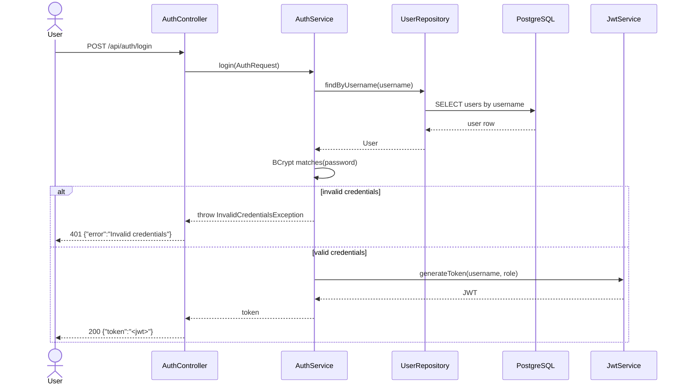
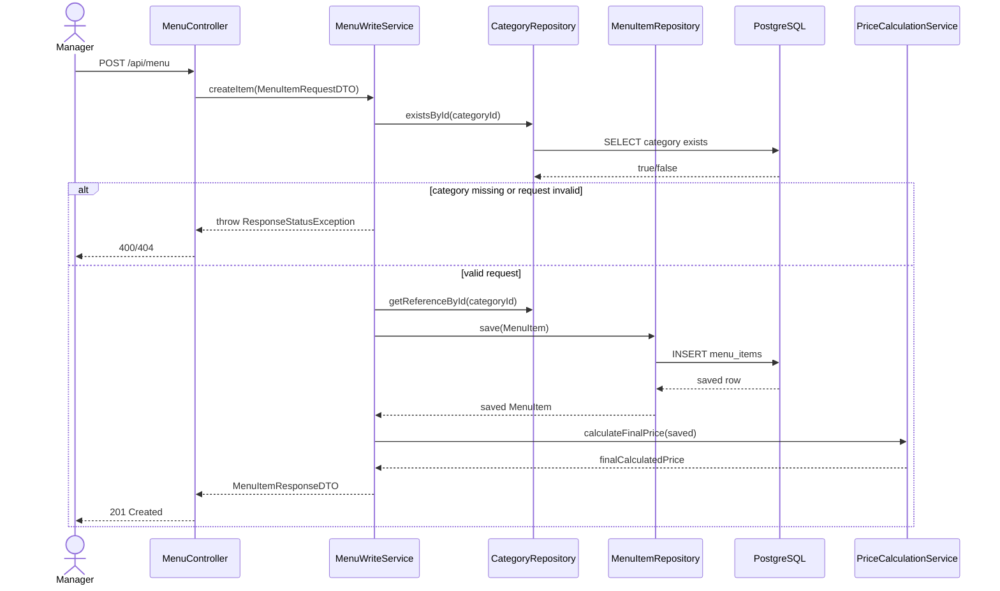
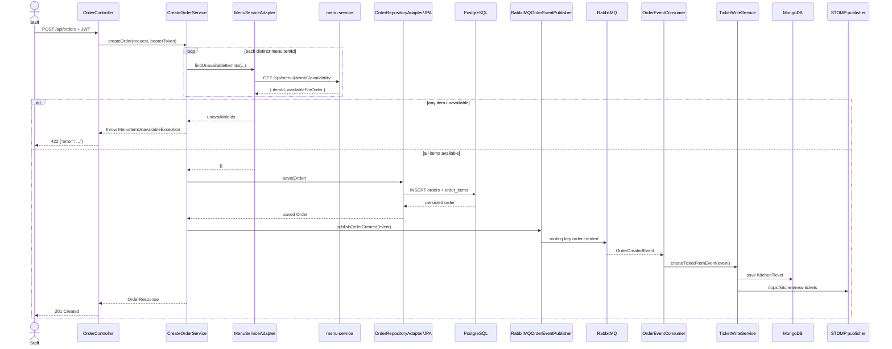
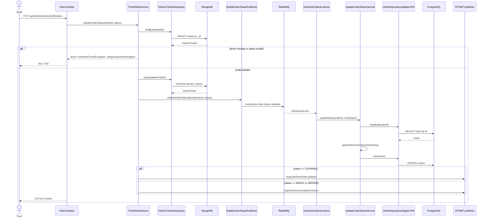
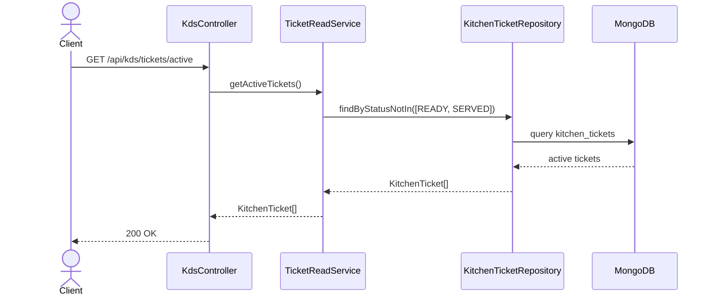

# Sequence Flow

Các sơ đồ dưới đây mô tả flow hiện đang có trong source. Mình dùng Mermaid `sequenceDiagram` để thể hiện cả REST flow và async flow qua RabbitMQ/WebSocket.

## Auth login

## Create menu item

## Create order and fan out to KDS

## KDS status update and sync back to ordering

## Read active tickets

